# FDML operation notes

## Startup

1. Turn on the galvo scanner (GS) driver first, as it's most likely to generate surges affecting other equipment.

2. Turn on photoreceiver.

3. Turn on resonant scanner (RS) driver, and make sure it's in locked ("LOCKED") mode, and not oscillating ("OSC") mode.

4. Turn on optical spectrum analyzer (OSA). This takes a little while to start up. It may ask whether you want to perform a self-calibration. Because we do not require high precision to assess spectrum, this step is not necessary. Choose "cancel". Then put it into "repeat" mode.

5. Turn on oscilloscope. If screen blank (not showing position sensor signals for GS (channel 1) or RS (channel 2)), touch any button.

6. Start FDML (turn power key). The FDML should be started at least 30 minutes prior to adjusting spectrum, to allow its temperature to stabilize.

## Setting up FDML

### Initial steps

1. Access settings menu by pressing "System" button ("5" button). Then press the "8" button to select "Load/Save". Use the knob to highlight the last (or desired) settings. Then press the "Load"??? button. 

2. If the RS is in "locked" mode, you should hear a change in its hum as the FDML begins to drive it. Check the scope to make sure the resonant scanner is stable (not "wobbling"). Using scope, adjust amplitude knob on RS driver to desired range, nominally 5 V. (The scope's "measure" function is useful to do this quickly.)

3. A key function of the scope is to monitor GS position while deciding when to start acquisition. Turn of channel 2 on scope (RS channel) and adjust scope time scale to 1 second to best visualize the GS signal.

### Key-value editing

1. Press "5"/"System" on the FDML to open the system menu, then "7"/"K->V Edit" to bring up the key-value editor.

2. Use knob to scroll through settings. 

3. Make sure "Acq-Start Sync To", "RG 1st Frame Trigger", "RG Frame Trigger" are all set to "RG:Even".

4. Set "RG Regulator Target Phase" to 3900. Shortcut to do this: press "Change", then "0", then type in 3900, then press "Change" again.

5. Set "Y Amplitude" to desired amplitude. 9365 corresponds to 5 V on RS (1.5 mm / 5 deg on retina), which gives a square raster on retina.

6. Verify that "Y Offset" is set to 460.

7. Verify that "Y Rise Samples" is 392 and "Y Fall Samples" is 128. [Do we need to change these for line scanning mode?]

8. Select desired "Y Repeat Count". Default may be 10, useful for most angiography applications.

9. FDML doesn't load the correct value for "Clk-Out Cycles / Sweep" (1024) unless you change it (e.g. to 1023) and then change it back to 1024, so do this.

### Starting the laser and adjusting its spectrum

1. Make sure nothing in the sample channel is present that might reflect light back to the laser (e.g., a model eye). The feedback from the sample channel will prevent correct laser calibration.

2. Press the "Start" button on the FDML panel (lower left). This will initialize the FDML's auto-calibration procedure. During this process, the OSA will show the FDML's output, initially a narrow band spectrum that moves through the full spectral range.

3. The FDML will make a series of beeps when it's done adjusting its spectrum, and its nominally correct spectrum will be visible on the OSA.

4. If the spectrum looks good and the three fiber Bragg grating indicators on the FDML front panel are consistently green, skip the next steps in this section.

5. If auto-calibration did not work correctly, press "Acknowledge" button to see error codes. Press "Clear" button to clear the warnings. This will reveal whether new warnings are being generated or not.

6. Press "Escape" until you get back to the home screen.

7. Press "4", next to the polarization paddle angle indicators, to begin to adjust the paddles manually. There are four sets of 2 paddles, for the cavity, buffer 0, buffer 1, and buffer 2.

8. Generally you want to adjust the "cavity" paddles first, as these affect all four copies of the sweep. Select the cavity paddles using the soft key under the cavity paddle, and then use the knob to adjust these, while watching both the OSA and FDML (blue) plots of the spectrum. Keep in mind that these are reversed with respect to one another--long wavelength on the left on the FDML and on the right on OSA.

9. Once the spectrum looks okay, press "Escape" to get back to the home screen.

10. Turn off the laser by pressing the red "Laser" button. (This button can be used to turn on and off the laser with the current polarization paddle settings.)

11. Restart the auto-calibration procedure by pressing "Start". The idea here is that you've chosen reasonable settings for the paddles and now the FDML is going to optimize its timing based upon the new paddle positions. This auto-calibration procedure does not change the paddle angles.

12. If the spectrum is still poor, repeat steps 5-11.

## Calibrating and preparing the FDML software

1. Turn off the RS temporarily, using its red power switch.

2. Launch the FDML LabVIEW VI. As of November, 2017, the correct version was 8.I.

3. Click "Start" or "Run" to start the software.

4. If you don't start seeing the sweeps of the spectrum, quit LabVIEW, start the Alazar digitizer software (Alazar DSO) and acquire data with it first, then go back to step 2.

5. Make sure that the first ("Config") is active, and adjust the yellow and red windows on the spectrum. The yellow window indicates what you're going to compute live, and the red window determines the range over which a calibration curve is computed. The yellow window should be just inside the edges of the first sweep, and the red window just inside the yellow window (see figure below). 

    N.B. 1: All the data is saved, so these endpoints can be adjusted during your post-processing steps; the limits imposed here only affect the real-time processing used for visualization.
    
    N.B. 2: The spectrum here looks different from what is shown on the OSA and FDML panels because LabVIEW is showing a balanced, AC coupled version of the FDML's DC signal. Capacitive coupling amounts to DC-subtraction, such that the sign of the signal may change. Negative-going parts of the DC spectrum (e.g., a notch or kink in the spectrum) tend toward zero in the AC coupled signal.

6. Make sure that the peak heights (or trough heights, since the peak of the spectrum is inverted) for the four copies of the spectrum are similar. If they aren't, adjust the polarization paddles for the sweep copies, and perhaps the paddles for the cavity as well (see "Starting the laser and adjusting the spectrum", above. These heights should be within 1000 digitizer ADUs of one another.

7. If the spectrum has changed for the worse, now is a good time to adjust the cavity polarization paddle again to reshape the spectrum.

8. Switch to the "Image preview" tab and look at the live B-scan view. While observing the noise in this image, adjust the FDML sweep frequency (main oscillator frequency). To do this, press the first row soft key and then use the knob. **Do not change the frequency by more than +/- 20 Hz.**

9. Making sure no light is returning from the sample channel, click the "Capture background" and "Subtract background" buttons. The white plot in the LabVIEW panel (the live spectrum) should go to zero (or close to zero), while the red plot will show the unsubtracted live spectrum [??? or is it the saved background plotted in red? Also, is there a yellow plot there as well?].

## Imaging a model eye

1. Place model eye with mirror in system, putting its screw in the third row of holes on the table in the column aligned with the optical axis.

2. Even when the reference arm length is considerably off, something like fringes will appear in the LabVIEW "Config" tab spectrum (white plot). This is spurious interference.

3. Adjust the reference arm until you get clean fringes. Identify the matched position (lowest frequency fringes), and then pull the reference mirror further back. This puts the zero-delay line behind the model eye retina.

4. Verify that the acquisition and calibration windows (yellow and red, respectively) are at the ends of the first full sweep, i.e., the first full envelope of the interference fringe.

5. Click "Acquire recal fringes with mirror." [Is this the "calibration" step referred to in step 7 below? If so, this instruction here might be misplaced, i.e., you must move the mirror to the 200th time point before clicking.] Switch to the "Image preview" tab to see a live image of the mirror, and then switch back. This step optimizes dispersion compensation and waveform (chirp) compensation.

6. Watch the A-line plot as you move the reference mirror and check to see that there are no harmonic images of the mirror--an indication of saturation artifacts.

7. Bring the peak to the 200th time point, using the reference mirror, and then click the calibration button [??? Is this the "Acquire recal fringes with mirror" button?].

8. We need to save these fringes for our own post-processing as well, so switch to the "Image preview" tab and enter "Calibration_200" for the file name. Set number of A-scans to save to 784 and number of B-scans to 100 (instead of, e.g., 5200 for retinal imaging).

9. Move the mirror to 100 and repeat step 8 with "Calibration_100" for the filename. **Don't click "Acquire recal fringes" again at this point.**

10. Click "Save state file" to save the calibration data. This permits reloading it later in case the system crashes or you accidentally click "Acquire recal fringes with mirror" with an eye in the system.

11. Replace mirror in model eye with paper or resolution target and turn on resonant scanner.

12. Adjust the K-V RS Target Phase (from default 3900) if the two book-matched scans visible in the LabVIEW VI are not centered on the screen.

## General notes and caveats

1. Be careful with the RS drive cable (the cable on the far right of the RS driver). It is susceptible to connection problems if stressed. Make sure the wires are taped to the top of the driver so that they don't pull on the connector.

2. Do not leave the GS driver on for prolonged periods of time, as this puts undue wear on the galvo.

3. When adjusting the FDML spectrum, avoid using the automatic paddle adjusters (labeled "Cavity" and "Buffer" at the top right), as these algorithms tend not to work.

4. If the FDML is working correctly, $\Delta \lambda$ should be between 80 and 83 nm--ideally closer to 83 nm--and $\lambda$ should be between 1063 and 1065 nm. If $\Delta \lambda$ drops below 80 nm, the laser is going to fail within the next hour or so.

5. Any time you adjust polarization paddles and reshape the spectrum, you have to capture and subtract a new background.

6. Any time you adjust the main oscillator frequency, you have to capture and subtract a new background.

7. If image quality is poor, try:

    a. Check the background-subtracted spectrum (white plot) in the "Config" window. If it's not flat and close to zero, clear the sample channel, capture another background image, and subtract the background again. An alternative to clearing the sample channel is physically blocking the beam in the sample channel.
    
    b. Adjusting spectrum (see above).
    

## Scan settings

Some example settings:

- 1.5mm x 1.5mm: 9365 for Y GS amplitude (in the FDML K-V settings), 5 V for RS amplitude

- 1.2mm x 1.2mm: 7500 for Y GS amplitude, 4 V for RS amplitude

More generally:

- GS range (ADU) = 1873 ADU / deg

- RS voltage = 1 V / deg

## Shutdown

1. Turn off the LabVIEW VI using the "Exit" button that's within the software.

2. Turn off resonant scanner driver.

3. Turn off FDML (turn the key--separately stopping the laser is not necessary).

4. Turn of OSA and confirm with "Yes" button.

5. Turn off scope.

6. Turn off photoreceiver.

7. Turn of galvo driver. **Don't leave galvo driver on overnight.**

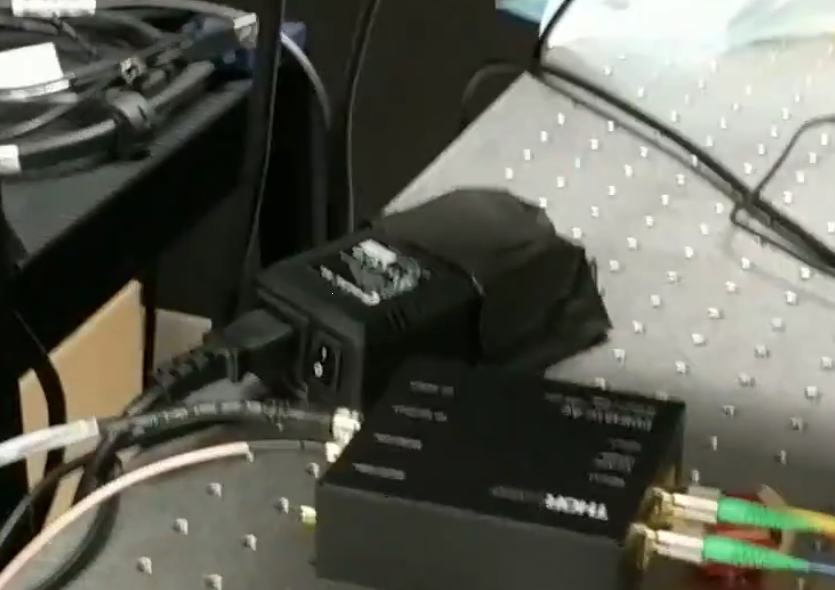

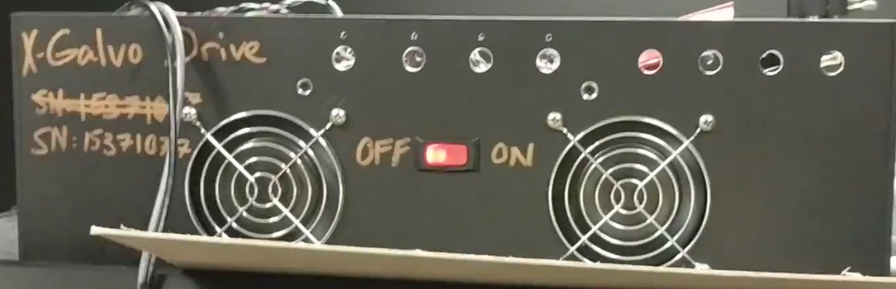

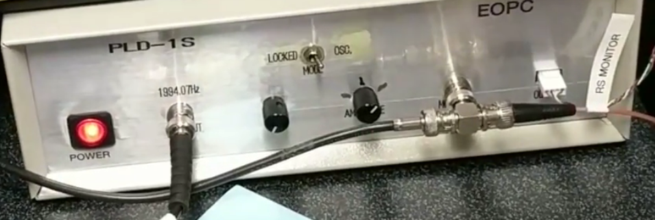

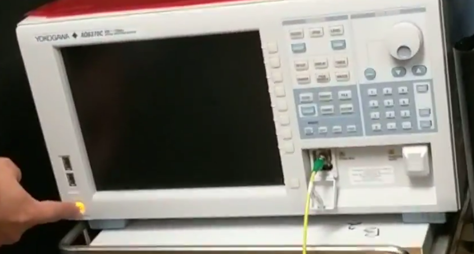

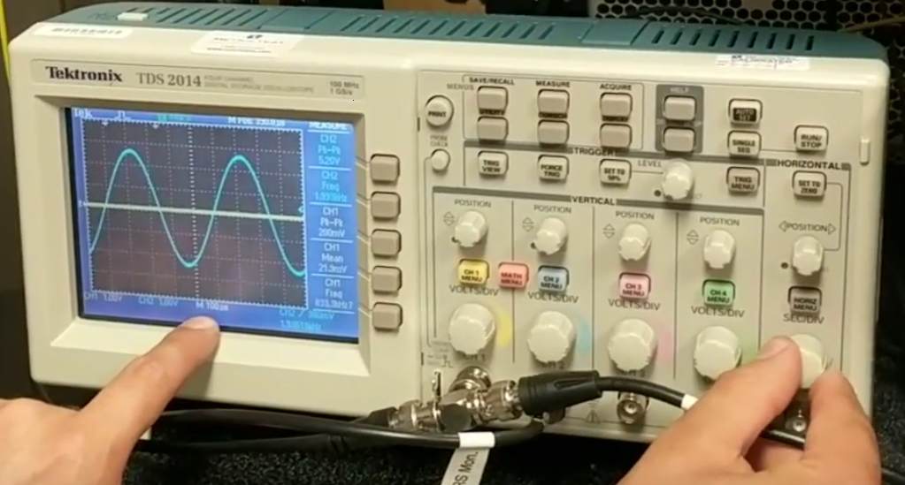

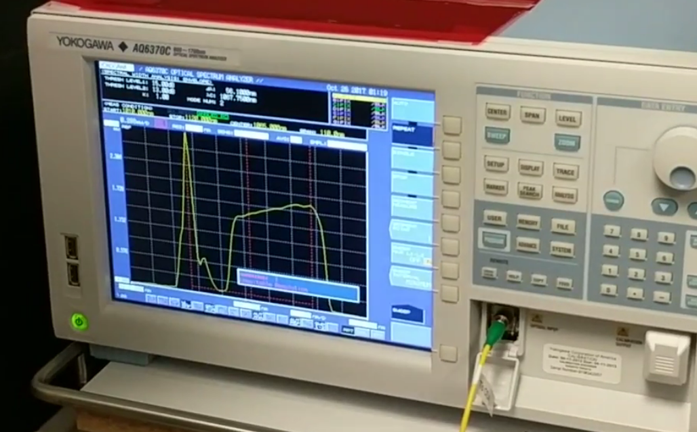

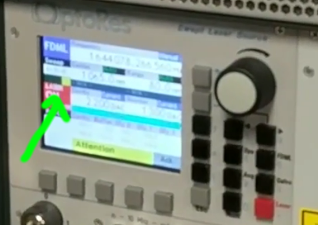

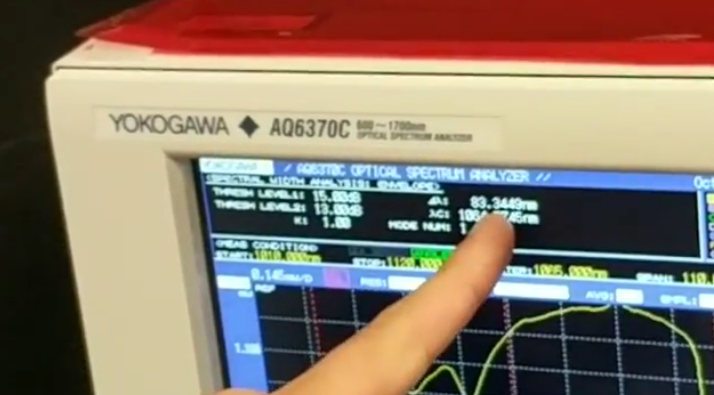

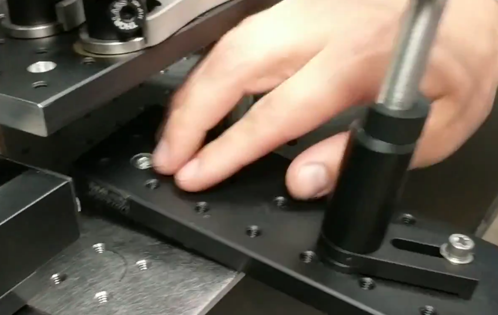

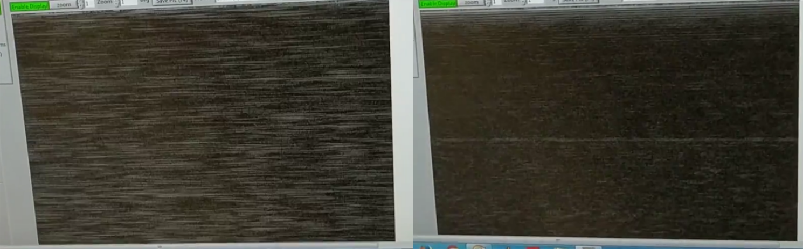

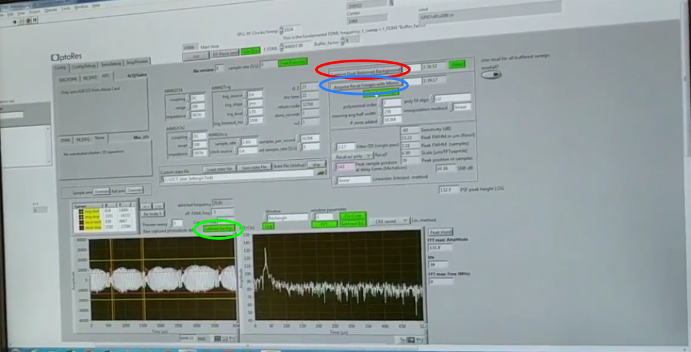

